UML Diagram for JavaScript Design Pattern Examples
===

This project lists UML diagrams of the "[Design Pattern Examples in JavaScript](https://github.com/takaakit/design-pattern-examples-in-javascript)". When you click on a diagram image, the diagram will be opened in **Diagram Map**. If you want to know about Diagram Map, see [this post](https://dev.to/takaakit/diagram-map-tracing-uml-sysml-elements-across-diagrams-49i7).

Behavioral Patterns
---
|  |  |  |
| :---: | :---: | :---: |
| **Chain of Responsibility** | **Command** | **Interpreter** |
| <a href="https://htmlpreview.github.io/?https://github.com/takaakit/uml-diagram-for-javascript-design-pattern-examples/blob/master/behavioral-patterns/chain-of-responsibility/diagram_map.html">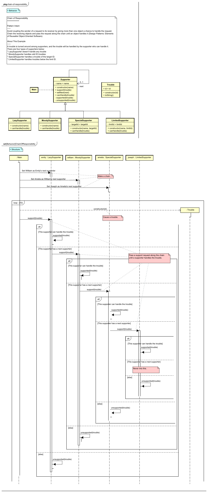</a> <a href="https://github.com/takaakit/design-pattern-examples-in-javascript/tree/master/behavioral-patterns/chain-of-responsibility">JavaScript Code</a> <a href="./behavioral-patterns/chain-of-responsibility/execution_result.png">Execution Result</a> | <a href="https://htmlpreview.github.io/?https://github.com/takaakit/uml-diagram-for-javascript-design-pattern-examples/blob/master/behavioral-patterns/command/diagram_map.html">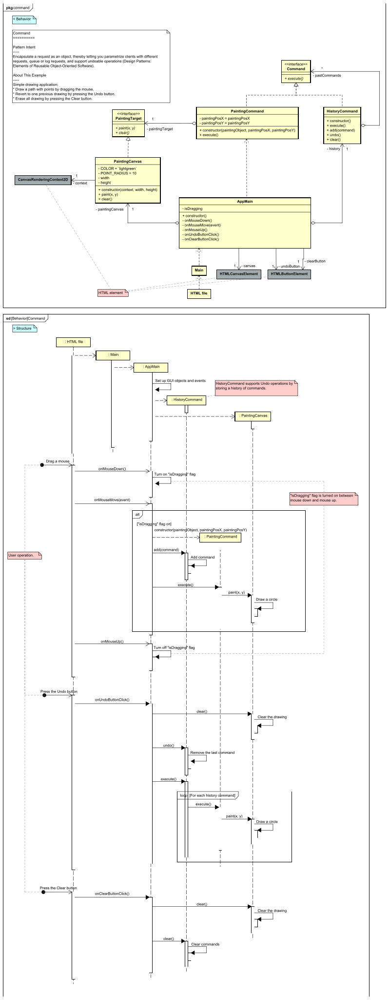</a> <a href="https://github.com/takaakit/design-pattern-examples-in-javascript/tree/master/behavioral-patterns/command">JavaScript Code</a> <a href="./behavioral-patterns/command/execution_result.png">Execution Result</a> | <a href="https://htmlpreview.github.io/?https://github.com/takaakit/uml-diagram-for-javascript-design-pattern-examples/blob/master/behavioral-patterns/interpreter/diagram_map.html">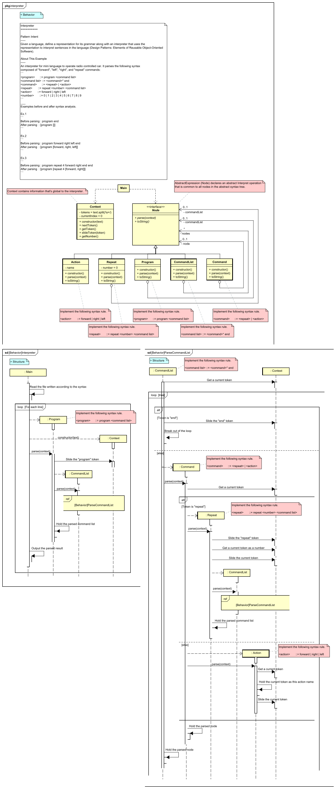</a> <a href="https://github.com/takaakit/design-pattern-examples-in-javascript/tree/master/behavioral-patterns/interpreter">JavaScript Code</a> <a href="./behavioral-patterns/interpreter/execution_result.png">Execution Result</a> |
| **Iterator** | **Mediator** | **Memento** |
|  <a href="https://github.com/takaakit/design-pattern-examples-in-javascript/tree/master/behavioral-patterns/iterator">JavaScript Code</a> <a href="./behavioral-patterns/iterator/execution_result.png">Execution Result</a> | <a href="https://htmlpreview.github.io/?https://github.com/takaakit/uml-diagram-for-javascript-design-pattern-examples/blob/master/behavioral-patterns/mediator/diagram_map.html">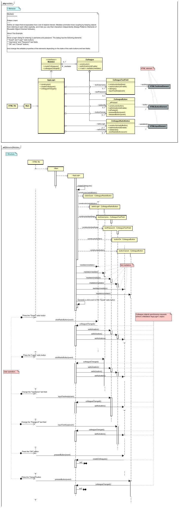</a> <a href="https://github.com/takaakit/design-pattern-examples-in-javascript/tree/master/behavioral-patterns/mediator">JavaScript Code</a> <a href="./behavioral-patterns/mediator/execution_result.png">Execution Result</a> |  <a href="https://github.com/takaakit/design-pattern-examples-in-javascript/tree/master/behavioral-patterns/memento">JavaScript Code</a> <a href="./behavioral-patterns/memento/execution_result.png">Execution Result</a> |
| **Observer** | **State** | **Strategy** |
| <a href="https://htmlpreview.github.io/?https://github.com/takaakit/uml-diagram-for-javascript-design-pattern-examples/blob/master/behavioral-patterns/observer/diagram_map.html">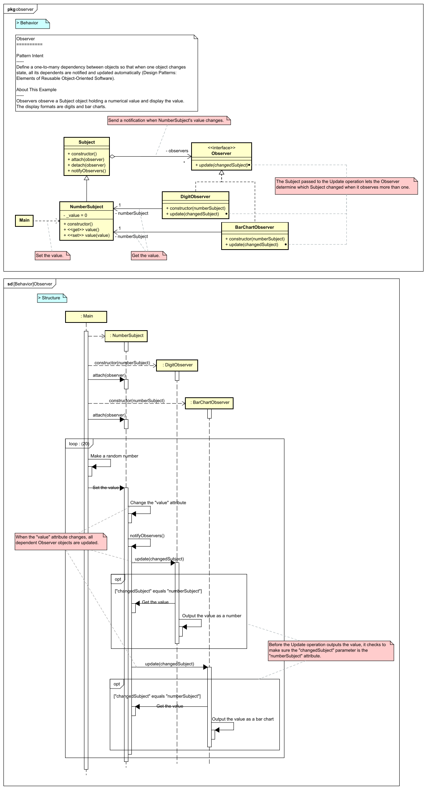</a> <a href="https://github.com/takaakit/design-pattern-examples-in-javascript/tree/master/behavioral-patterns/observer">JavaScript Code</a> <a href="./behavioral-patterns/observer/execution_result.png">Execution Result</a> |  <a href="https://github.com/takaakit/design-pattern-examples-in-javascript/tree/master/behavioral-patterns/state">JavaScript Code</a> <a href="./behavioral-patterns/state/execution_result.png">Execution Result</a> | <a href="https://htmlpreview.github.io/?https://github.com/takaakit/uml-diagram-for-javascript-design-pattern-examples/blob/master/behavioral-patterns/strategy/diagram_map.html">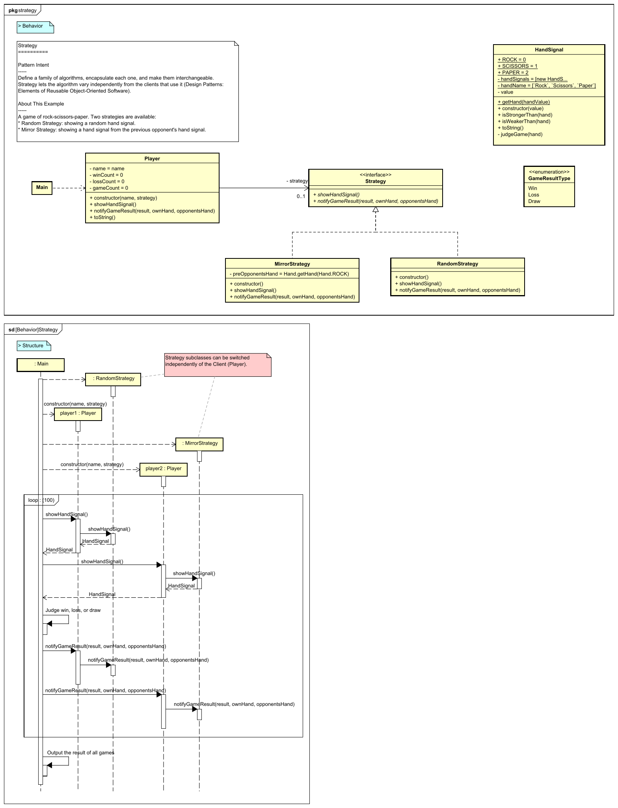</a> <a href="https://github.com/takaakit/design-pattern-examples-in-javascript/tree/master/behavioral-patterns/strategy">JavaScript Code</a> <a href="./behavioral-patterns/strategy/execution_result.png">Execution Result</a> |
| **Template Method** | **Visitor** |  |
|  <a href="https://github.com/takaakit/design-pattern-examples-in-javascript/tree/master/behavioral-patterns/template-method">JavaScript Code</a> <a href="./behavioral-patterns/template-method/execution_result.png">Execution Result</a> | <a href="https://htmlpreview.github.io/?https://github.com/takaakit/uml-diagram-for-javascript-design-pattern-examples/blob/master/behavioral-patterns/visitor/diagram_map.html">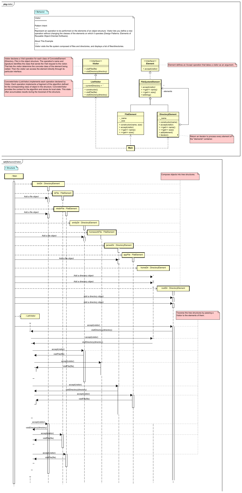</a> <a href="https://github.com/takaakit/design-pattern-examples-in-javascript/tree/master/behavioral-patterns/visitor">JavaScript Code</a> <a href="./behavioral-patterns/visitor/execution_result.png">Execution Result</a> |  |

Creational Patterns
---
|  |  |  |
| :---: | :---: | :---: |
| **Abstract Factory** | **Builder** | **Factory Method** |
| <a href="https://htmlpreview.github.io/?https://github.com/takaakit/uml-diagram-for-javascript-design-pattern-examples/blob/master/creational-patterns/abstract-factory/diagram_map.html">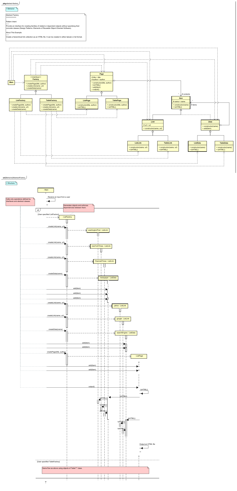</a> <a href="https://github.com/takaakit/design-pattern-examples-in-javascript/tree/master/creational-patterns/abstract-factory">JavaScript Code</a> <a href="./creational-patterns/abstract-factory/execution_result.png">Execution Result</a> | <a href="https://htmlpreview.github.io/?https://github.com/takaakit/uml-diagram-for-javascript-design-pattern-examples/blob/master/creational-patterns/builder/diagram_map.html">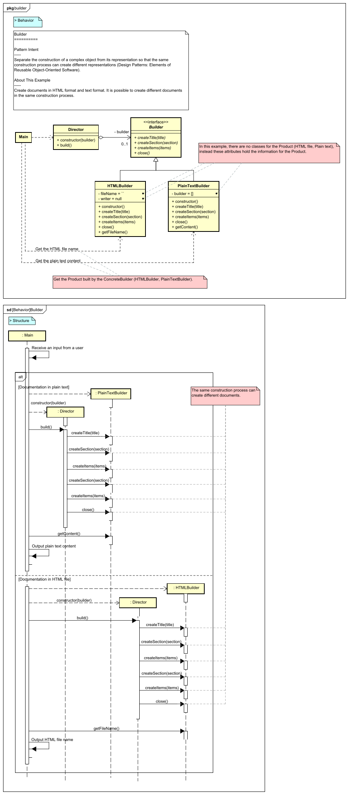</a> <a href="https://github.com/takaakit/design-pattern-examples-in-javascript/tree/master/creational-patterns/builder">JavaScript Code</a> <a href="./creational-patterns/builder/execution_result.png">Execution Result</a> | <a href="https://htmlpreview.github.io/?https://github.com/takaakit/uml-diagram-for-javascript-design-pattern-examples/blob/master/creational-patterns/factory-method/diagram_map.html">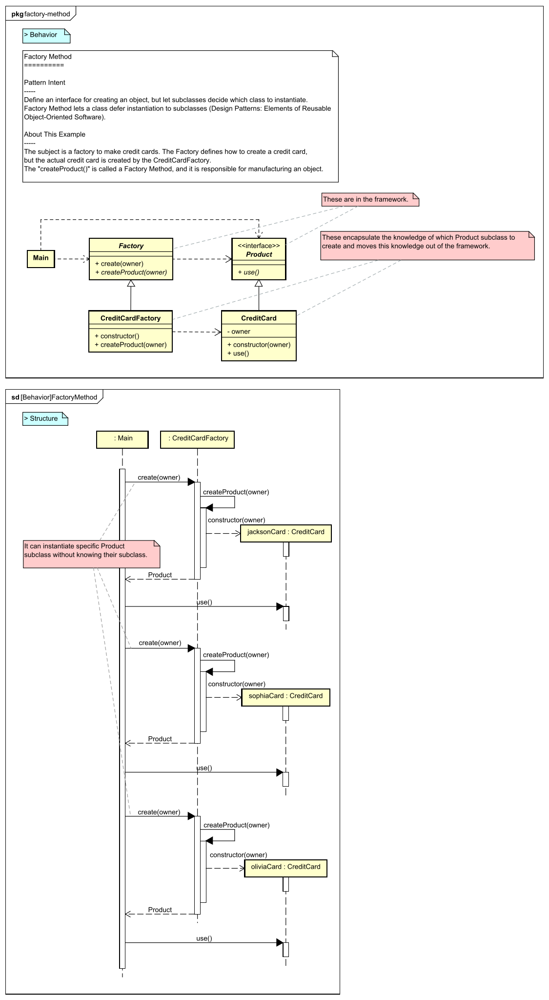</a> <a href="https://github.com/takaakit/design-pattern-examples-in-javascript/tree/master/creational-patterns/factory-method">JavaScript Code</a> <a href="./creational-patterns/factory-method/execution_result.png">Execution Result</a> |
| **Prototype** | **Singleton** |  |
| <a href="https://htmlpreview.github.io/?https://github.com/takaakit/uml-diagram-for-javascript-design-pattern-examples/blob/master/creational-patterns/prototype/diagram_map.html">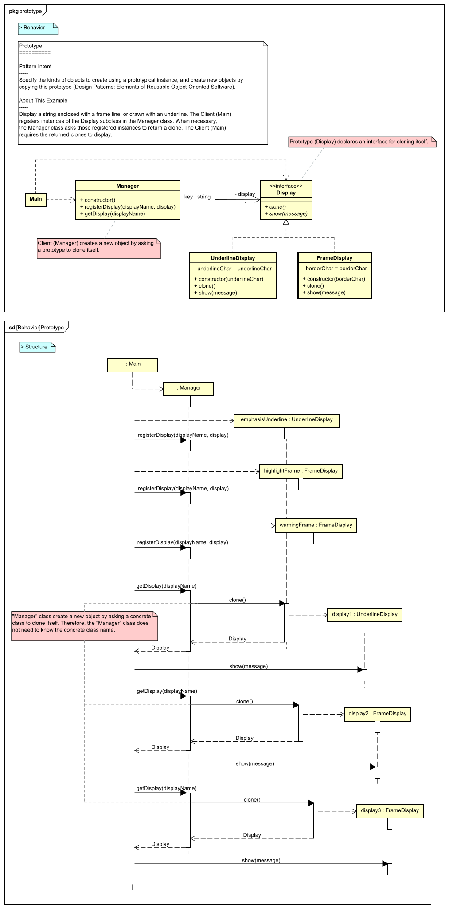</a> <a href="https://github.com/takaakit/design-pattern-examples-in-javascript/tree/master/creational-patterns/prototype">JavaScript Code</a> <a href="./creational-patterns/prototype/execution_result.png">Execution Result</a> | <a href="https://htmlpreview.github.io/?https://github.com/takaakit/uml-diagram-for-javascript-design-pattern-examples/blob/master/creational-patterns/singleton/diagram_map.html">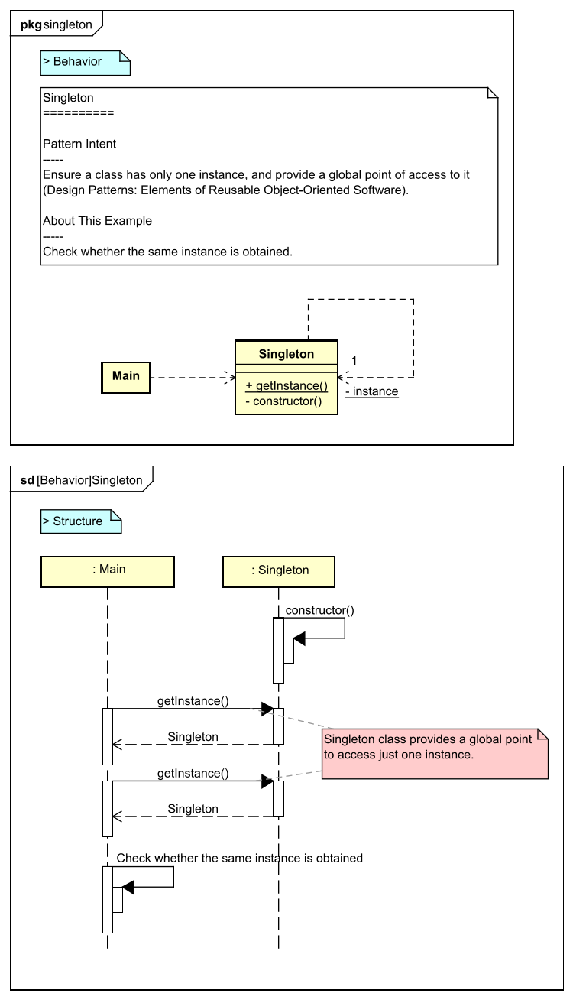</a> <a href="https://github.com/takaakit/design-pattern-examples-in-javascript/tree/master/creational-patterns/singleton">JavaScript Code</a> <a href="./creational-patterns/singleton/execution_result.png">Execution Result</a> |  |

Structural Patterns
---
|  |  |  |
| :---: | :---: | :---: |
| **Adapter** | **Bridge** | **Composite** |
| <a href="https://htmlpreview.github.io/?https://github.com/takaakit/uml-diagram-for-javascript-design-pattern-examples/blob/master/structural-patterns/adapter/diagram_map.html">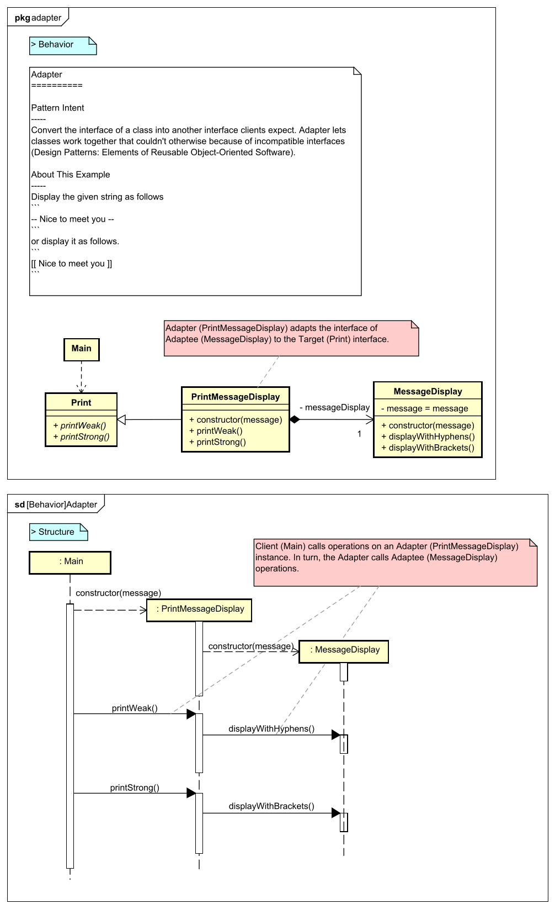</a> <a href="https://github.com/takaakit/design-pattern-examples-in-javascript/tree/master/structural-patterns/adapter">JavaScript Code</a> <a href="./structural-patterns/adapter/execution_result.png">Execution Result</a> |  <a href="https://github.com/takaakit/design-pattern-examples-in-javascript/tree/master/structural-patterns/bridge">JavaScript Code</a> <a href="./structural-patterns/bridge/execution_result.png">Execution Result</a> | <a href="https://htmlpreview.github.io/?https://github.com/takaakit/uml-diagram-for-javascript-design-pattern-examples/blob/master/structural-patterns/composite/diagram_map.html">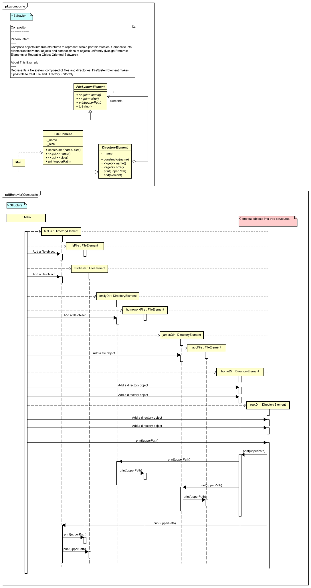</a> <a href="https://github.com/takaakit/design-pattern-examples-in-javascript/tree/master/structural-patterns/composite">JavaScript Code</a> <a href="./structural-patterns/composite/execution_result.png">Execution Result</a> |
| **Decorator** | **Facade** | **Flyweight** |
| <a href="https://htmlpreview.github.io/?https://github.com/takaakit/uml-diagram-for-javascript-design-pattern-examples/blob/master/structural-patterns/decorator/diagram_map.html">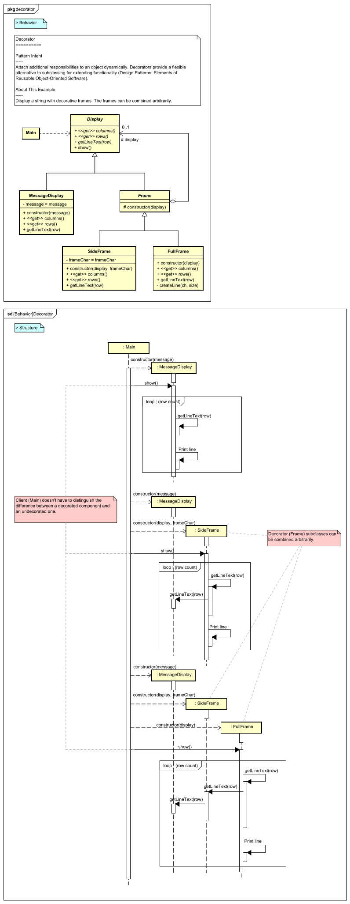</a> <a href="https://github.com/takaakit/design-pattern-examples-in-javascript/tree/master/structural-patterns/decorator">JavaScript Code</a> <a href="./structural-patterns/decorator/execution_result.png">Execution Result</a> | <a href="https://htmlpreview.github.io/?https://github.com/takaakit/uml-diagram-for-javascript-design-pattern-examples/blob/master/structural-patterns/facade/diagram_map.html">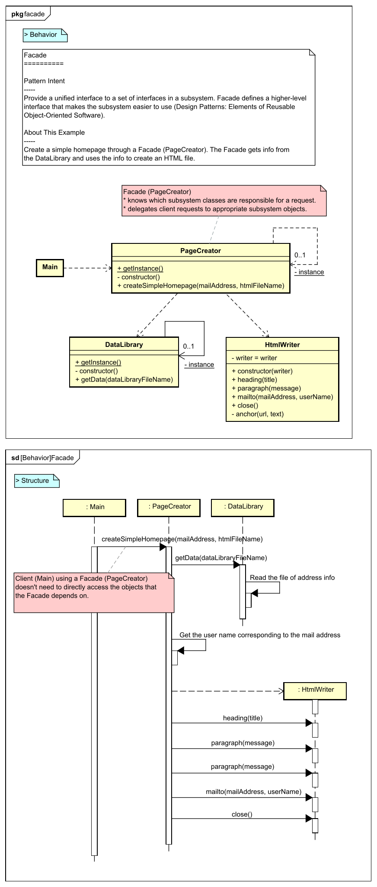</a> <a href="https://github.com/takaakit/design-pattern-examples-in-javascript/tree/master/structural-patterns/facade">JavaScript Code</a> <a href="./structural-patterns/facade/execution_result.png">Execution Result</a> |  <a href="https://github.com/takaakit/design-pattern-examples-in-javascript/tree/master/structural-patterns/flyweight">JavaScript Code</a> <a href="./structural-patterns/flyweight/execution_result.png">Execution Result</a> |
| **Proxy** |  |  |
| <a href="https://htmlpreview.github.io/?https://github.com/takaakit/uml-diagram-for-javascript-design-pattern-examples/blob/master/structural-patterns/proxy/diagram_map.html">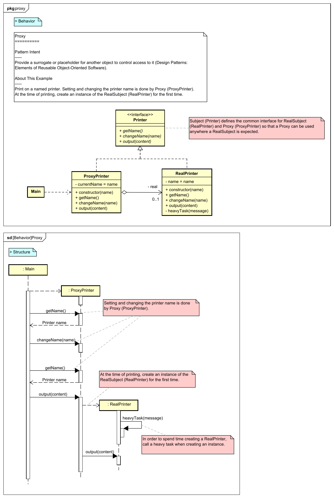</a> <a href="https://github.com/takaakit/design-pattern-examples-in-javascript/tree/master/structural-patterns/proxy">JavaScript Code</a> <a href="./structural-patterns/proxy/execution_result.png">Execution Result</a> | | |

References
---
* Gamma, E. et al. Design Patterns: Elements of Reusable Object-Oriented Software, Addison-Wesley, 1994
* Hiroshi Yuki. Learning Design Patterns in Javas [In Japanese Language], Softbank publishing, 2004

Links
---
* [Design Pattern Examples in JavaScript](https://github.com/takaakit/design-pattern-examples-in-javascript)
* [Diagram Map: tracing UML/SysML elements across diagrams](https://dev.to/takaakit/diagram-map-tracing-uml-sysml-elements-across-diagrams-49i7)

Licence
---
Diagram Map file (diagram_map.html) includes the following libraries:
* [D3 library](https://d3js.org) is copyrighted by Mike Bostock and is released under the [BSD license](https://opensource.org/licenses/BSD-3-Clause).
* [Popper library](https://popper.js.org/) is copyrighted by Federico Zivolo and is released under the [MIT license](https://opensource.org/licenses/MIT).
* [Tippy library](https://atomiks.github.io/tippyjs/) is copyrighted by atomiks and is released under the [MIT license](https://opensource.org/licenses/MIT).

Files and data in this project other than the above libraries are under the [Creative Commons Zero (CC0) license](https://creativecommons.org/publicdomain/zero/1.0/).

Other Language Examples
-----------------------
[C++](https://github.com/takaakit/uml-diagram-for-cpp-design-pattern-examples), [C#](https://github.com/takaakit/uml-diagram-for-csharp-design-pattern-examples), [Crystal](https://github.com/takaakit/uml-diagram-for-crystal-design-pattern-examples), [Go](https://github.com/takaakit/uml-diagram-for-golang-design-pattern-examples), [Java](https://github.com/takaakit/uml-diagram-for-java-design-pattern-examples), [Kotlin](https://github.com/takaakit/uml-diagram-for-kotlin-design-pattern-examples), [Python](https://github.com/takaakit/uml-diagram-for-python-design-pattern-examples), [Ruby](https://github.com/takaakit/uml-diagram-for-ruby-design-pattern-examples), [Scala](https://github.com/takaakit/uml-diagram-for-scala-design-pattern-examples), [Swift](https://github.com/takaakit/uml-diagram-for-swift-design-pattern-examples), [TypeScript](https://github.com/takaakit/uml-diagram-for-typescript-design-pattern-examples)
